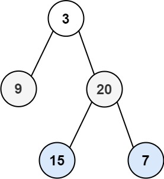

# Tree patterns



## Traverse pattern

### DFS

- Use recursion to traverse each node

```go
dfs(root) {
    if (!root) {
        return nil
    }
    dfs(root.left)
    dfs(root.Right)

}
```

- Fits if we care about path, "do I need to explore one path deeply?" or "do I need enumerate configuration"

### BFS

- Use a FIFO queue to store the nodes in the tree, initialize it with the root, loop until the queue len is 0
- Then a inner loop, also operate until the queue is empty, to store the children of current nodes in the queue, after each iteration, pop a node in the front of the queue
  - after that, append the children of the next level to the queue and continue

there are 2 approach to BFS

```go
queue := []*TreeNode{root}
for i := 0; i < len(queue); i++ {
	node := queue[i]
	if node.Left != nil {
		queue = append(queue, node.Left)
	}
	if node.Right != nil {
		queue = append(queue, node.Right)
	}
	// use node (e.g. collect Val) — each index i is visited exactly once
}
```

the 2nd approach is at [102 binary tree level order traversal](../new/20260413/102_binary_tree_level_order_traversal.md)

---

- Fit if we care about travel level by level, and more about closer nodes than the far ones, when the result likely contains all nodes in the tree
